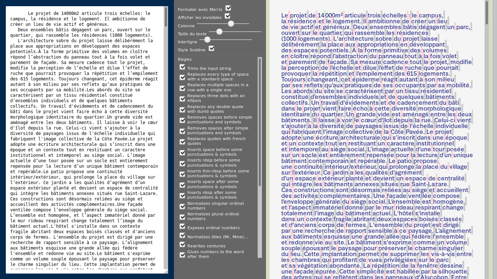

# Morris
Morris is a locale-defined typographic rules fixer.
The set of rules we're currently building is for the french language.
It's designed to operate on raw text, and apply rules either for plaintext, environments like Adobe Indesign, Html... This property is named "context" thereafter.

Its counterpart to work in a DOM environment and add real layout rules, such as line awareness, content block size awareness, hyphenation (or avoidance of), will be found at [@documents-design/morris-dom.git](https://github.com/documents-design/morris-dom.git).

[Tester here](https://documents-design.github.io/morris-demo)


## Usage

```js
const m = new Morris(); // "frenchRules" rules are loaded by default.
const m = new Morris(frenchRules); // equivalent
const m = new Morris([frenchRules, otherRules]); // two sets of rules will be merged.

m.apply(inputText, context, ruleId); // applies an individual rule
m.format(inputText, context) // applies every rule
```

## Runtime extension

You could have special rules that depend on your particular project. For instance, we had a case where the symbol `(m.)` should be treated as-is and not like the rest of punctuation rules.
Let's add a runtime rule for this. `getRuleID` gives the next available ID.
```js
const m = new Morris();

m.addRule({
    id: william.getRuleID(),
    description: "Avoids messing with (m.) symbols.",
    contexts: {
        brut: {
            find: /\(\s*m\.\s*\)\s*/gi,
            replace: "(m.)"
        }
    },
})
```
Since this rule is added last, it repairs the harm done to our `(m.)` symbol.

## Rules
All rules satisfy RuleInterface.

Some rules are stateless, and just find/replace operations.

```js
{
    id: 1,
    description: "Replaces three dots with an ellipsis",
    contexts: {
        brut: {
            find: /\.{3}/gi,
            replace: `${LIST.ELLIPSIS}`
        }
    }
}
```

Some rules must be stateful : they don't need a `find` property.  
Their `replace` property is a function taking the whole string as an argument.  
You're then free to iterate on it, use a parsing strategy, [...]

```typescript
{
    description: "Replaces quotes with french quotes",
    contexts: {
        brut: {
            replace(str: string): string {
                  let open = false
                  let output = ""
                  for (const char of str) {
                      if (char === "\"") {
                          output += open ? LIST.RQUOTE : LIST.LQUOTE
                          open = !open
                          continue
                      }
                      output += char
                }
                return output
            }
        }
    }
}
``` 

## Current implemented rules

See this Google Sheet : https://docs.google.com/spreadsheets/d/e/2PACX-1vSHDGzcEMT3FkEvMxCl8PyqqadIad4_CI0QyXZvywU_Hz499cvt-zE29oMV7FvPfSVeyK2jAeMD7OUg/pubhtml?gid=0&single=true

---

## Testing
We're currently using a test infrastructure that allows graphic designers to write the tests : the table below is converted by `node gentest.js` to tests that Jest can run.


```json
[
  {
    "id": "1",
    "description_fr": "Remplace trois points par le caractère points de suspension",
    "description_en": "Replaces three dots with an ellipsis",
    "tests": [
      []
    ]
  },
  {
    "id": "2",
    "description_fr": "Remplace les guillemets anglais par des guillemets français",
    "description_en": "Replaces quotes with french quotes",
    "tests": [
      [
        {
          "type": "brut",
          "test": "\"régler\"",
          "resultat": "«régler»"
        }
      ]
    ]
  }
]
```
and becomes 
```typescript
describe("Replaces three dots with an ellipsis", () => {});
describe("Replaces quotes with french quotes", () => {
    it("in the context of brut", () => {
        const formatted = mo.apply(`"régler"`, `brut`, 2);
        expect(formatted).toEqual(`«régler»`);
    });
});
describe("Ensures non-breaking space after opening quote", () => {
    it("in the context of brut", () => {
        const formatted = mo.apply(`«régler»`, `brut`, 3);
        expect(formatted).toEqual(`«\u00A0régler»`);
    });
});
```
## Contributing

We'd accept contributions, but this project should mature a bit before. As long as modifications are lightweight and don't pull external dependencies outside of `devDependencies`, you're free to contribute. The style guide is what `node_modules/.bin/tslint --fix` produces. 

### Références

- https://en.wikipedia.org/wiki/Whitespace_character#Unicode
- http://j.poitou.free.fr/pro/html/typ/resume.html
- https://fr.wikipedia.org/wiki/Lexique_des_r%C3%A8gles_typographiques_en_usage_%C3%A0_l%27Imprimerie_nationale
